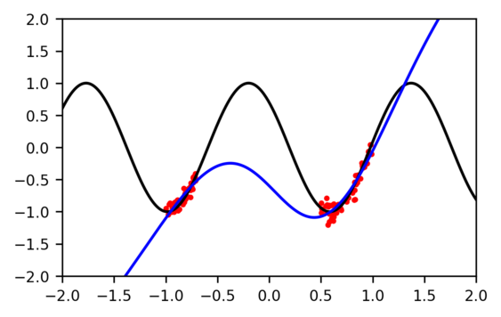
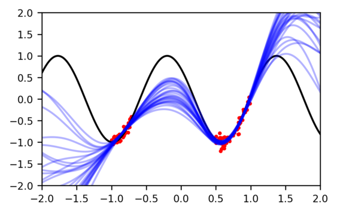

# TyXe: Pyro-based BNNs for Pytorch users

TyXe aims to simplify the process of turning [Pytorch](www.pytorch.org) neural networks into Bayesian neural networks by
leveraging the model definition and inference capabilities of [Pyro](www.pyro.ai).
Our core design principle is to cleanly separate the construction of neural architecture, prior, inference distribution
and likelihood, enabling a flexible workflow where each component can be exchanged independently.
Defining a BNN in TyXe takes as little as 5 lines of code:
```
net = nn.Sequential(nn.Linear(1, 50), nn.Tanh(), nn.Linear(50, 1))
prior = tyxe.priors.IIDPrior(dist.Normal(0, 1))
likelihood = tyxe.likelihoods.HomoskedasticGaussian(scale=0.1)
inference = tyxe.guides.AutoNormal
bnn = tyxe.VariationalBNN(net, prior, likelihood, inference)
```

In the following, we assume that you (roughly) know what a BNN is mathematically.


## Motivating example
Standard neural networks give us a single function that fits the data, but many different ones are typically plausible.
With only a single fit, we don't know for what inputs the model is 'certain' (because there is training data nearby) and
where it is uncertain.

|  |  |
|:---:|:---:|
| Maximum likelihood fit | Posterior samples |

Implementing the former can be achieved easily in a few lines of Pytorch code, but training a BNN that gives a
distribution over different fits is typically more complicated and is specifically what we aim to simplify.

## Training

Constructing a BNN object has been shown in the example above. 
For fitting the posterior approximation, we provide a high-level `.fit` method similar to libraries such as scikit-learn
or keras:

```
optim = pyro.optim.Adam({"lr": 1e-3})
bnn.fit(data_loader, optim, num_epochs)
```

## Prediction & evaluation

Further we provide `.predict` and `.evaluation` methods, which make predictions based on multiple samples from the approximate posterior, average them based on the observation model, and return log likelihoods and an error measure:
```
predictions = bnn.predict(x_test, num_samples)
error, log_likelihood = bnn.evaluate(x_test, y_test, num_samples)
```

## Local reparameterization

We implement [local reparameterization](https://arxiv.org/abs/1506.02557) for factorized Gaussians as a poutine, which reduces gradient noise during training.
This means it can be enabled or disabled at both during training and prediction with a context manager:
```
with tyxe.poutine.local_reparameterization():
    bnn.fit(data_loader, optim, num_epochs)
    bnn.predict(x_test, num_predictions)
```
At the moment, this poutine does not work with the `AutoNormal` and `AutoDiagonalNormal` guides in pyro, since those draw the weights from a Delta distribution, so you need to use `tyxe.guides.ParameterwiseDiagonalNormal` as your guide. 

## MCMC

We provide a unified interface to pyro's MCMC implementations, simply use the `tyxe.MCMC_BNN` class instead and provide a kernel instead of the guide:
```
kernel = pyro.infer.mcmcm.NUTS
bnn = tyxe.MCMC_BNN(net, prior, likelihood, kernel)
```
Any parameters that pyro's `MCMC` class accepts can be passed through the keyword arguments of the `.fit` method.

## Continual learning

Due to our design that cleanly separates the prior from guide, architecture and likelihood, it is easy to update it in a continual setting.
For example, you can construct a `tyxe.priors.DictPrior` by extracting the distributions over all weights and biases from a `ParameterwiseDiagonalNormal` instance using the `get_detached_distributions` method and pass it to `bnn.update_prior` to implement [Variational Continual Learning](https://arxiv.org/abs/1710.10628) in a few lines of code.
See `examples/vcl.py` for a basic example on split-MNIST and split-CIFAR. 

## Network architectures

We don't implement any layer classes.
You construct your network in Pytorch and then turn it into a BNN, which makes it easy to apply the same prior and inference strategies to different neural networks.
  
## Inference

For inference, we mainly provide an equivalent to pyro's `AutoDiagonalNormal` that is compatible with local reparameterization in `tyxe.guides`.
This module also contains a few helper functions for initialization of Gaussian mean parameters, e.g. to the values of a pre-trained network.
It should be possible to use any of pyro's autoguides for variational inference.
See `examples/resnet.py` for a few options as well as initializing to pre-trained weights.   

## Priors

The priors can be found in `tyxe.priors`.
We currently only support placing priors on the parameters.
Through the expose and hide arguments in the init method you can specify layers, types of layers and specific parameters over which you want to place a prior.
This helps, for example in learning the parameters of BatchNorm layers deterministically.
 

## Likelihoods

`tyxe.observation_models` contains classes that wrap the most common `torch.distributions` for specifying noise models of data to   


# Installation

We recommend installing TyXe using conda with the provided `environment.yml`, which also installs all the dependencies for the examples except for Pytorch3d, which needs to be added manually.
The environment assumes that you are using CUDA11.0, if this is not the case, simply change the `cudatoolkit` and `dgl-cuda` versions before running:
```
conda env create -f environment.yml
conda activate tyxe
pip install -e .
```

## Citation
If you use TyXe, please consider citing:
```
@inproceedings{ritter2022tyxe,
  title={Ty{X}e: Pyro-based {B}ayesian neural nets for {P}ytorch},
  author={Ritter, Hippolyt and Karaletsos, Theofanis},
  booktitle={Proceedings of Machine Learning and Systems},
  year={2022}
}
```
