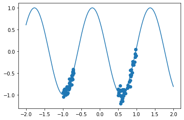
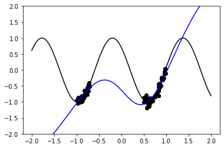
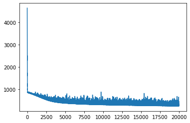
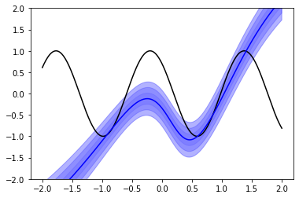
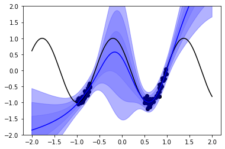
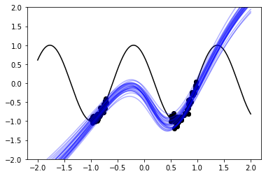

.. code:: 

    from functools import partial
    
    import matplotlib.pyplot as plt
    %matplotlib inline
    
    import torch
    import torch.nn as nn
    import torch.utils.data as data
    
    import pyro
    import pyro.distributions as dist
    
    import tyxe
    pyro.set_rng_seed(42)

Simple Regression Using TyXe
============================

TyXe is a Bayesian neural network library build on top of Pytorch and
Pyro. It cleanly separates the architecture, prior, inference and
likelihood specification allowing users to iterate quickly over
different variations of these components. On top of this modularity, it
implements a lot of the “tricks” which make Bayesian Neural Networks
useful in practice in a simple usable way. As such, it is meant to be a
library so that practicioners and researchers alike can quickly an
efficiently have acces to unceratinty estimation techniques.

This tutorial serves as a general overview of TyXe and bayesian neural
neural networks by using as an example a simple non-linear regression.

General Motivation
------------------

Assume that we have data :math:`\mathcal{D} = \{(x_i, y_i)\}` and we
want to model :math:`p(y|x)`. One way to tackle this problem is by
introducing a parametrized family of functions that map :math:`x` to
probability distributions. In other words we introduce functions
:math:`f_\theta`, in our case neural networks, such that
:math:`p(y|f_\theta(x))`. A common choice in regression problems is to
assume that :math:`p(y|x) = \mathcal{N}(f_\theta(x),\sigma^2)` and
to the find the “best” :math:`\theta` by performing MLE estiamation.
However, this set-up is not without its
disadvantages. As it has been shown, among other issues, such models can
be prone to overconfidence and forgetting (see [1] and [2] for
particular examples).

One attempt to tackle these problems is to be bayesian with respect to
the parameters. In this framework, rather than doing point estimation
through MLE we instead define a probability distribution over all of the
parameters of our model. Then, based on the observations that we see and
through the use of Bayes’ theorem, we infer the posterior distribution
of the parameters. This framework aids both with the problem of
overconfidence, as we are able to separate cleanly between the
uncertainty with respect to the estimate of the parameters and the
uncertainty with respect to the inherent randomness of the data, and
with catastrophic forgetting, as a bayesian setting provides a clear way
of updating our “beliefs” without loosing information about the past
(see references [1] and [3] for a more extensive discussion of these
topics). Although we won’t delve into catastrophic forgetting in this
tutorial, it certainly helpful to keep it in mind as one of the
advantages of bayesian neural networks over a more traditional setting.

Having explained why bayesian neural networks can be useful, we are
ready to demonstrate how to implement them using TyXe. We do so with a
concrete example using non-linear regression.

A concrete example
------------------

Let’s create first a toy dataset that we will use throughout the
demonstration. We will create it as follows: We assume that
:math:`x_i \sim \text{Uniform(-1,1.3)}` for :math:`1 \leq i \leq 50` and
:math:`x_i \sim \text{Uniform(0,0.5) + 1}` for
:math:`51 \leq i \leq 100`. And we assume that

.. math::  y \sim \mathcal{N}(4x + 0.8, 0.01)

In code:

.. code:: 

    x1 = torch.rand(50, 1) * 0.3 - 1
    x2 = torch.rand(50, 1) * 0.5 + 0.5
    x = torch.cat([x1, x2])
    y = x.mul(4).add(0.8).cos() + 0.1 * torch.randn_like(x)
    
    x_test = torch.linspace(-2, 2, 401).unsqueeze(-1)
    y_test = x_test.mul(4).add(0.8).cos()

.. code:: 

    dataset = data.TensorDataset(x, y)
    loader = data.DataLoader(dataset, batch_size=len(x))

.. code:: 

    plt.scatter(x.squeeze(), y)
    plt.plot(x_test.squeeze(), y_test)

In an ideal world we would like our model to be able to “understand”
that it has more informations for the points closer to :math:`-1` and
:math:`0.5` than points outside this range. Our goal will be to build up
to that result.

First Approach: MLE
-------------------

To have a point of comparison we will first fit a neural newtwork to our
dataset using MLE and plot the results.

.. code:: 

    net = nn.Sequential(nn.Linear(1, 50), nn.Tanh(), nn.Linear(50, 1))
    optim = torch.optim.Adam(net.parameters(), 1e-4)
    for _ in range(10000):
        optim.zero_grad()
        net(x).sub(y).pow(2).mean().backward()
        optim.step()

.. code:: 

    plt.scatter(x, y, color="black")
    plt.plot(x_test, y_test, color="black")
    plt.plot(x_test, net(x_test).detach(), color="blue")
    plt.ylim(-2, 2)

Although it gets the results correct around the regions where we have
samples, it is clear that as we get farther away the quality of the
predictions deteriorates. Moreover, there is nothing in the results of
the predictions which alerts us of such the deterioration.

The Bayesian Approach
---------------------

Finally, we can start working with a bayesian neural network. Roughly,
we can divide this process in 3 parts: 1. Model definition 2. Inference
1. Model Criticism and Predictions

Below we describe what it each step requires and how TyXe helps us with
it.

Step 1: Model Definition
------------------------

Defining a model refers to establishing the probability distributions
from which the parameters and observed data are drawn. In other words we
specify :math:`p(y|x,\theta)p(\theta)`. TyXe requires that we do this by
specifying the following objects

1) **Neural network**: This is the function which specifies the way in
   which :math:`p(y|x,\theta)` depends on :math:`x`. In other words,
   this is :math:`f_\theta`. Any neural network specified in Pytorch
   which subclasses the ``nn.Module`` class can be used for this
   purpose. Due to this flexibility and the large number of classes that
   exist in PyTorch, it is easy for practioners and researchers to apply
   bayesian methods to a large array of architectures. The code below
   shows how easy it is to define one such simple neural network.

.. code:: 

    net = nn.Sequential(nn.Linear(1, 50), nn.Tanh(), nn.Linear(50,1))

2) **Prior**: This defines the probability distribution over the
   parameters of the neural network, that is :math:`p(\theta)`. In TyXe
   they are specified via ``tyxe.priors.Prior`` object. For this example
   we assume that every parameter will have the exact same distribution
   and that they are independent and identically distributed. This is
   done via ``tyxe.priors.IIDPrior`` which is used with a
   one-dimensional pyro distribution which can be extended to the shape
   of each site of the parameters inside of the neural network.
   TyXe also allows for more general priors including layer-wise priors
   that provide a bayesian equivalent to “Radford”, “Xavier” and
   “Kaming” initializations.

.. note::
   An important point is that TyXe allows users to excludee
   certain parameters of the neural network from being treated in a
   Bayesian way. This can be done by passing a hide_module_types or
   hide_module argument to the prior. In the case of the former we pass
   a list of classes inherting from nn.Module (eg. [nn.BatchNorm2D]) and
   in the case of the latter we pass particular nn.Modules objects from
   our neural net.

.. code::

    prior = tyxe.priors.IIDPrior(dist.Normal(0, 1))

1) **Likelihood:** This defines the :math:`p(y|x,\theta)` term by
   specifying how the output of the neural network is to be used to
   describe the probability distribution. In TyXe this is done via a
   ``tyxe.likelihoods.Likelihood`` object. In our case we will use
   ``tyxe.likelihoods.HomoskedasticGaussian`` which implies that the
   data is modeled as
   :math:`p(y|x,\theta) = \mathcal{N}(f_\theta(x), \sigma^2)` and thus,
   the variance is the same regardless of the point that we choose.
   An important detail is that all likelihoods require that we specify
   the size of the dataset that needs to be used in advace via the
   ``dataset_size`` argument when constructing the object. This is so
   that when using minibatches the loss can be scaled adequately.
   Furthermore, in addition to the likelihood used for this particular
   example, TyXe also contains implementations of Categrical
   distributions, Bernoulli distributions, and distributions where we
   also model the variance as well as the mean.

.. code::

    obs_model = tyxe.likelihoods.HomoskedasticGaussian(len(x), scale=0.1)

Step 2: Inference
-----------------

Once we specify our model we need to do inference to learn the posterior
distribution for the parameters. This is the second step in working with
bayesian neural networks. TyXe implements both stochastic variational
inference and MCMC algorithms for obtaining the posterior distribution
of the neural network. Moreover, algorithms for performing inference are
all implemented through a keras-like interface which makes them fast and
easy to use.

.. warning::

   For anything other than very small datasets like the one here
   currently implemented MCMC algorithms will be too slow to be
   practical and thus shouldn’t be used. We mention them in this
   tutorial as way of comparing Variational Inference, the perefered
   inference method of this library, with the asymptotically correct
   result.

Method 1: Stochastic Variational Inference (prefered)
~~~~~~~~~~~~~~~~~~~~~~~~~~~~~~~~~~~~~~~~~~~~~~~~~~~~~

Stochastic Variational Inference is a process by which we approximate
the complex posterior distribution of our parameters by a simpler
distribution from a family which is easier to handle. We refer the
reader to `this tutorial <https://pyro.ai/examples/svi_part_i.html>`__
for an in-depth discussion of SVI. Because of the nature of SVI, in
addition to the model it is also necessary that we specify the family of
distributions we will use to approximate the posterior. In TyXe this is
done by the a ``guide`` and guide builder.

Using a guide builder
^^^^^^^^^^^^^^^^^^^^^

To specify which family we want to use we create a guide builder which
will determine how each unseen parameter will be approximated. The code
below shows how to create one such builder.

Currently, via the via the ``tyxe.guides.AutoNormal`` object, TyXe
supports the variational family in which every parameter is sampled
independently from a normal distribution. This object is passed to the
constructor of the neural network so that it builds the guide at each of
the unobseved sample sites. The ``partial`` function below is simply a
way to specify that everytime a guide is created it should be
initialized with the particular parameters we chose, in this case
``init_scale=0.01``.

.. code::

    guide_builder = partial(tyxe.guides.AutoNormal, init_scale=0.01)

Calling ``.fit()``
^^^^^^^^^^^^^^^^^^

Finally, once all of the above has been done, we can instantiate our
neural network as a ``VariationalBNN`` object and train it using its fit
method.

Optionally, when calling ``.fit()`` we can pass a callback function
which is invoked after each training epoch. This function can be used
for tracking values of the ELBO, monitoring convergence, or applying
some form of early stopping. This callback must take as arguments the
neural network, the epoch, and the average value of the ELBO over the
specified epoch. Below we use it to save the ELBO to a list that will
let us assess the convergence of the model.

A subtle but important detail is that the optimizer which we use to
train our network must come from ``pyro.optim`` and not from
``torch.optim``. This is not a issue as every major optimizer that
exists in ``torch`` has an equivalent version in ``pyro``.

.. code:: 

    bnn = tyxe.VariationalBNN(net, prior, obs_model, guide_builder)

.. code:: 

    pyro.clear_param_store()
    optim = pyro.optim.Adam({"lr": 1e-3})
    elbos = []
    def callback(bnn, i, e):
        elbos.append(e)
        
    bnn.fit(loader, optim, 20000, callback)

.. code::

    plt.plot(elbos)

.. parsed-literal::

    [<matplotlib.lines.Line2D at 0x13fa63ca0>]

MCMC
~~~~

Alternatively, instead of doing approximate inference via SVI it is
possible to do exact inference using Markov Chain Monte Carlo
algorithms. The only differences in the way that it is specified are
that instead of a guide we provide a
`kernel <https://docs.pyro.ai/en/stable/mcmc.html>`__ from Pyro i.e a
method for drawing samples from the chain, and we use a ``bnn.MCMC_BNN``
to create the neural network.

Unfortunately, although the inference is exact in the limit. It is also
significantly slower than SVI and thus for most practical problems it
shouldn’t be used. A more thorough discussion of MCMC can be found
`here <https://arxiv.org/pdf/1701.02434.pdf>`__

.. code:: 

    pyro.clear_param_store()
    mcmc_net = nn.Sequential(nn.Linear(1, 50), nn.Tanh(), nn.Linear(50, 1))
    mcmc_prior = tyxe.priors.IIDPrior(dist.Normal(0, 1))
    mcmc_likelihood = tyxe.likelihoods.HomoskedasticGaussian(len(x), scale=0.1)
    kernel = partial(pyro.infer.mcmc.HMC, step_size=1e-3, num_steps=50, target_accept_prob=0.7)
    mcmc_bnn = tyxe.bnn.MCMC_BNN(mcmc_net, mcmc_prior, mcmc_likelihood, kernel)

.. code:: 

    mcmc_bnn.fit(loader, 100000, warmup_steps=20000)

.. parsed-literal::

    Sample: 100%|██████████| 120000/120000 [06:56, 288.05it/s, step size=2.03e-02, acc. prob=0.910]

Step 3: Prediction and Evaluation
---------------------------------

After we have estimated the posterior either through MCMC or SVI we can
make predictions on unseen data and decide how good of a fit we
obtained. Tyxe also helps us conveniently with these two tasks through
the ``.predict()`` and ``.evaluate()`` methods. ### Prediction As
specified before, the ``.predict()`` method in both neural nets allows
us to make predictions on new datasets. This method takes as input a
batch of data and the number of samples from the neural network that we
want to use to make the predictions. In the case of a ``VariationalBNN``
this is done by using the guide as an approximation of the posterior and
in the case of the ``MCMC_BNN`` this is done by using the samples drawn
when the ``fit`` method was called.

By default the ``.predict`` method returns an average of all of the
samples drawn and the standard deviation. However, it is possible for
the network to return all of the samples drawn by calling ``predict``
with ``aggregate=False``.

Below we use the predict function to plot estimates of the function

.. code:: 

    m, sd = bnn.predict(x_test, num_predictions=32)

.. code:: 

    plt.plot(x_test, y_test, color="black")
    plt.plot(x_test, m.detach(), color="blue")
    for c in range(1, 4):
        plt.fill_between(x_test.squeeze(), (m - c * sd).squeeze(), (m + c * sd).squeeze(), alpha=c * 0.1, color="blue")
    plt.ylim(-2, 2)

.. code:: 

    m, sd = mcmc_bnn.predict(x_test, num_predictions=32)

.. code:: 

    plt.scatter(x, y, color="black")
    plt.plot(x_test, y_test, color="black")
    plt.plot(x_test, m.detach(), color="blue")
    for c in range(1, 4):
        plt.fill_between(x_test.squeeze(), (m - c * sd).squeeze(), (m + c * sd).squeeze(), alpha=c * 0.1, color="blue")
    plt.ylim(-2, 2)

Alternatively, if we don’t aggregate the predictions we can use the
samples drawn to view various sampled functions.

.. code:: 

    sampled_predictions = bnn.predict(x_test, num_predictions=25, aggregate=False)
    plt.scatter(x, y, color="black")
    plt.plot(x_test, y_test, color="black")
    for yhat in sampled_predictions:
        plt.plot(x_test, yhat, color="blue", alpha=0.3)
    plt.ylim(-2, 2)

As we can see from the plots above, in a bayesian setting our neural
network obtains a better measurement about which points it is not
confident about. Now areas around which we don’t have a lot of data for
have higher standard deviation denoting an increase in uncertainty.

Evaluation
^^^^^^^^^^

Finally, we can use the ``.evaluate`` method to get an extimate of the
error of our predictions and the log likelihood. As before, we can
specify the number of samples that we would like to use for making the
predictions.

.. code:: 

    error, ll = bnn.evaluate(x_test, y_test, 32, reduction='mean')
    
    print('SVI: error - {:.3f}, log likelihood {:.3f}'.format(error, ll))

.. parsed-literal::

    SVI: error - 2.235, log likelihood -36.517

References
----------

[1] Chuan Guo, Geoff Pleiss, Yu Sun, & Kilian Q. Weinberger. (2017). On
Calibration of Modern Neural Networks.

[2] Ian J. Goodfellow, Mehdi Mirza, Da Xiao, Aaron Courville, & Yoshua
Bengio. (2015). An Empirical Investigation of Catastrophic Forgetting in
Gradient-Based Neural Networks.

[3] Cuong V. Nguyen, Yingzhen Li, Thang D. Bui, & Richard E. Turner.
(2018). Variational Continual Learning.
